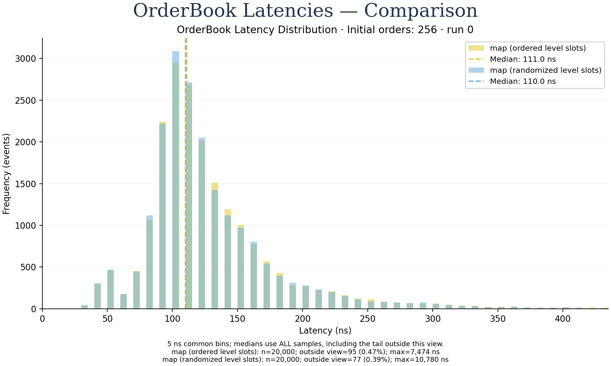
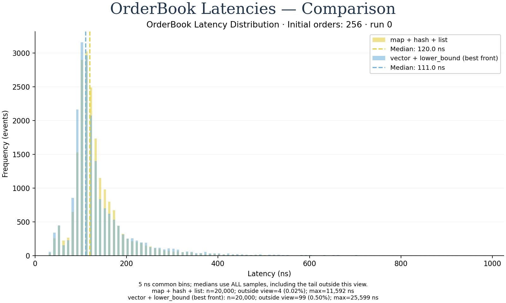
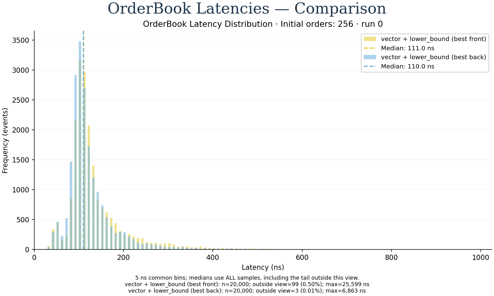
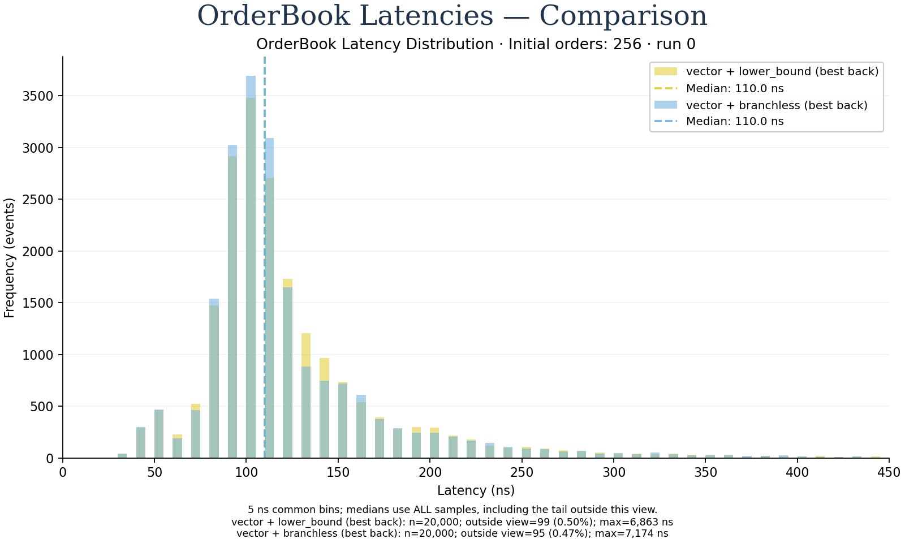
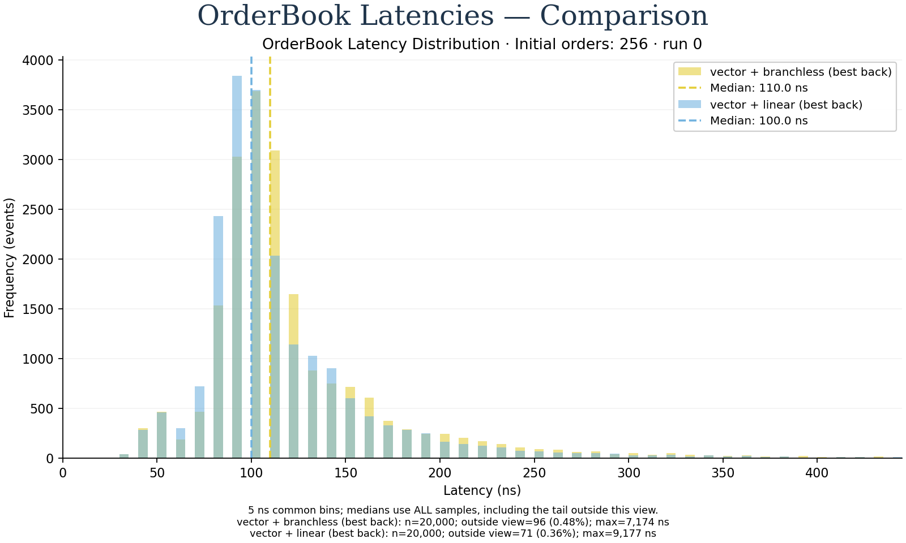

# OrderBook：按 CppCon 顺序进行的对照与优化

2026-09-27。历史基线 `e82ed12`、直方图提交 `7fcbcc8` 保留。本轮继续原有撮合/FIFO 语义，不把讲义的行情聚合簿性能当作本机目标。依据与页码见[参考笔记](order_book_cppcon_reference.md)。

## 实现顺序与边界

| 阶段 | before → after | 唯一主要变量与必要适配 |
|---|---|---|
| 分配布局对照 | map_slots_ordered → map_slots_random | 同一固定槽位资源，初始空闲槽位顺序 → seed=1729 随机排列；仅价位 map 节点受影响 |
| 1：vector | map_list → vector_front | map 目录 → vector + lower_bound，最佳价在前；ID index 改存稳定 list iterator，删除时按 price 重找目录 |
| 2：反转 | vector_front → vector_back | 最佳价从前端移至末端；保留 lower_bound 和全部撮合逻辑 |
| 3：branchless | vector_back → vector_branchless | 保持目录方向，换成固定迭代次数的二分搜索；比较结果用条件选择推进 base |
| 4：linear | vector_branchless → vector_linear | 保持目录方向，从最佳价末端开始线性搜索，返回相同 lower_bound 插入位置 |

布局实验不是加速轮次。`map_list` 仍使用默认分配器；槽位两组都在 setup 分配并触碰内存，初始槽位 64 字节对齐，步长按实际 map 节点大小向上取整。资源容量为逻辑 max_orders+1，允许 Modify 临时替代节点。复用均采用相同 LIFO 栈，随机版不在热路径调用 PRNG。初始排列 seed 与事件 seed=42 分开，地址排列哈希与相邻地址平均距离另存。它验证明确的物理布局假设，**不声称复刻讲义没有公布的 randomized allocator**，也不能把默认 malloc 与槽位版的差异单独归因于布局。

vector 直接保存 `(Price, list<Order>)`，没有额外价位对象分配。目录搬移使用 noexcept list move；标准 allocator 相等，list 节点迭代器仍有效。ID 索引不保存 vector iterator、指针或下标；因此失去 map 稳定价位 iterator 所省下的查找。这是换容器所必需的适配成本，必须计入比较。各 vector 版本均不预留 vector/hash 容量，不添加 pool，Add/Modify 仍先准备可能分配的节点再撮合。

## 验证

- GCC Release、Clang Release、GCC ASan+UBSan 各 **13/13 PASS**。七个版本都跑相同的完整状态/FIFO 差分测试，每版 32,000 个随机事件；另覆盖 0..65 个价位的全部插入间隙、双向改价、整簿吃单和 2,000 单 hash 增长/撤单。
- 分配失败注入对默认 map 与四个 vector 版本逐一失败 Add/Modify 的每个分配点；异常后完整逻辑状态不变。容量增长本身可以保留，不属于交易逻辑状态。
- 槽位测试验证真实相对地址排列可复现、不同 seed 改变排列、顺序布局步长、唯一地址、耗尽和释放复用。
- 两个编译器均无编译告警。测试及 build 日志见 [evidence](evidence/order-book-cppcon/)。

## 测量设计

同一最终 Release binary 重新测量全部七版。所有版本的 `apply` 标为 noinline，保持一致的函数调用边界，避免 map 的源文件边界与 vector 模板的内联可见性混入容器收益。初次未控制此差异的数据仍保留在 ignored raw 目录；本报告只使用修正后的重测。每种初始深度 16/256/4096 × latency/throughput 各三个独立进程；每一轮随机排序七版运行，顺序记录在 interleaved manifest，不并行测量。latency 每轮 20,000 事件、warmup=1000；throughput 每轮 30 次 × 20,000 事件、warmup=3。相同 event seed、trace hash、CPU、编译 flags、输出日志和 oracle。历史 v0 只留档，不混入本轮 before/after。

PMU group 在每段热 replay 前开启、结束立即关闭；包含 cycles、instructions、branches、branch misses、通用 cache misses。reset、reference、验证与结构统计均在区间外。计数不可用或发生复用时不输出精确 per-event 归因。这里的通用 cache-misses 不是 L1 miss，更不是完整 top-down 分解；本轮不冒充获得 backend-bound 比例。

结构统计使用单独的 `lab_order_book_diagnostics`，计数逻辑在 timed variants 中编译消除。它记录目录插入/删除次数和搬移的 Level 数，不等同于 CPU 字节流量；不会统计 vector 扩容额外搬移。查询 rank 桶按返回的插入位置相对最佳端定义，包含未命中，因此 front/back 的 rank 桶不要求完全相同。目录 capacity bytes 不包含 list/hash 节点，槽位 bytes 不代表整进程内存。

GCC Release 的 branchless `ensure` 和 `unlink` 中已观察到 `cmov`，保存[汇编](evidence/order-book-cppcon/branchless-assembly.txt)；循环、空目录和 side 选择仍有分支，不能说整个 OrderBook 无分支。热点区间分支计数用于判断算法改变是否影响失误，不只依靠源代码写法。

## 复现

```bash
./scripts/build_release.sh
# 在本机已有 perf capability 的 launcher 下运行；普通环境可直接 python3，缺少 PMU 会明确记录。
lab-perf python3 scripts/run_order_book_sequence.py --cpu 0 --output results/raw/order-book-cppcon-controlled-20260927
python3 tools/plot_order_book.py --campaign results/raw/order-book-cppcon-controlled-20260927/vector_front --campaign results/raw/order-book-cppcon-controlled-20260927/vector_back --output results/processed/order-book-round2
./build/release/lab_order_book_diagnostics
```

延迟图默认显示固定第 0 轮，共享 5 ns 分箱、完整样本 median 和窗口外 tail 计数；完整 CCDF 展示三轮，概览图展示三轮中位数与 min–max。所有原始事件样本均留档。三次进程重复不是三轮优化；上述四轮各有独立 before/after 定义。

## 本机结果

实现提交 `365f6eb`，调用边界控制修正 `a0bad04`。126 个独立进程均完成语义校验，共 1,260,000 个逐事件样本及 1,890 个 replay 均值样本；63 个 throughput 进程的 PMU running/enabled 均为 1。AMD EPYC 7C13，CPU 0，GCC 13.3 Release -O3 -DNDEBUG，native/LTO 关闭。未改变 governor、SMT 或隔离核设置。

下表为三个进程吞吐统计量的中位数，单位 **million events/s**；不是单事件 latency 的倒数，也不是固定深度压力测试。

| 版本 | 初始 16 单 | 初始 256 单 | 初始 4096 单 |
|---|---:|---:|---:|
| map_list | 9.068 | 8.893 | 6.939 |
| map_slots_ordered | 9.875 | 9.662 | 7.424 |
| map_slots_random | 9.822 | 9.564 | 7.063 |
| vector_front | 9.912 | 8.448 | 0.983 |
| vector_back | 10.583 | 9.991 | 6.994 |
| vector_branchless | 10.694 | 10.179 | 6.697 |
| vector_linear | 11.567 | 10.985 | 6.419 |

注意原始 workload 的深度随事件流下降：初始 16/256/4096 单分别最终剩 11/8/320 单，小簿可降至空。所得结论只适用于这三条固定 synthetic 轨迹。三轮离散度保留在每步 overview 图与 [comparisons.json](evidence/order-book-cppcon/plots/comparisons.json)，没有将小幅变化当作统计显著性结论。完整 mean/p99 与逐步收益见[逐步表](evidence/order-book-cppcon/plots/comparison-summary.md)。

### 测量前置：随机化价位节点布局

ordered → randomized 在初始 4096 单时吞吐约 -4.86%，mean latency 158.98 → 165.84 ns；小簿差异较小。本实验只改变 map 价位节点的初始物理位置，没有扰动 list/hash，也只测一个 allocation seed，不能据此否定或复现讲义中更大的差距。



[三种深度的概览](evidence/order-book-cppcon/plots/00-layout/order-book-summary.png) · [完整尾部](evidence/order-book-cppcon/plots/00-layout/order-book-tail.png)

### 第一轮：map → vector + lower_bound

初始 16 单吞吐约 +9.30%，256 单约 -5.00%，4096 单约 -85.84%。4096 单的 mean 173.28 → 1,003.85 ns，p99 672 → 6,833.20 ns；这是一轮明确的深簿退化，保留结果。撮合簿需要移动带 list 所有权的价位，不能直接套用讲义中较轻的聚合价位成本。



[三种深度的概览](evidence/order-book-cppcon/plots/01-vector/order-book-summary.png) · [完整尾部](evidence/order-book-cppcon/plots/01-vector/order-book-tail.png)

### 第二轮：最佳价放末端

初始 4096 单的目录插入/删除搬移总数 **3,999,396 → 42,994**（不含 vector 扩容），对应吞吐 **0.983 → 6.994M events/s**，约为前一版的 7.12 倍，但只是恢复到接近 map 基线。初始 256 单吞吐约 +18.25%。结构统计给出搬移减少的直接证据，不能把全部时间变化精确分解为搬移成本。



[三种深度的概览](evidence/order-book-cppcon/plots/02-reverse/order-book-summary.png) · [完整尾部](evidence/order-book-cppcon/plots/02-reverse/order-book-tail.png) · [搬移和查询分布 CSV](evidence/order-book-cppcon/directory-diagnostics.csv)

### 第三轮：branchless 二分

初始 256 单吞吐约 +1.89%；4096 单约 -4.25%，p99 661 → 782 ns。4096 单每事件 branch misses **5.364 → 2.650**，cycles **438.594 → 457.471**：失误减少并不保证整体变快。依赖加载/条件选择成本是后续可检验的解释，本轮没有完整 top-down/热区调用栈来证明它。



[三种深度的概览](evidence/order-book-cppcon/plots/03-branchless/order-book-summary.png) · [完整尾部](evidence/order-book-cppcon/plots/03-branchless/order-book-tail.png)

### 第四轮：从最佳端线性搜索

初始 256 单吞吐约 +7.92%，到达 **10.985M events/s**，相对本轮 map 基线约 +23.52%；mean latency 为 **115.29 ns**，p99 为 **341 ns**。4096 单却再下降约 -4.15%，最终比 map 低约 7.49%。4096 单每事件 instructions 从 **881.621 → 1,385.883**，说明长距离扫描的工作量确实增加；p99 从 782 降至 631 ns，也说明均值、尾部和吞吐不能混为一个指标。



[三种深度的概览](evidence/order-book-cppcon/plots/04-linear/order-book-summary.png) · [完整尾部](evidence/order-book-cppcon/plots/04-linear/order-book-tail.png)

## 留档与下一关

五组对比各有 16/256/4096 三张直方图，以及 overview 和完整 CCDF，均保存 PNG/SVG。共有 **25 张 PNG + 25 张 SVG**。图中固定 run 0 的 median 与报告中的三轮 median-of-statistics 分开标注。

- [完整原始 campaign 压缩包](evidence/order-book-cppcon/raw-campaign.tar.gz)：包含 interleaved 原始执行顺序、全部逐事件数据、逐版可绘图 campaign、manifest、环境、源码及 binary 哈希。
- [归档校验与命令](evidence/order-book-cppcon/provenance.json)、[执行日志](evidence/order-book-cppcon/campaign.log)、[图表验证](evidence/order-book-cppcon/validation.log)。
- 批量绘图：`python3 tools/plot_order_book_sequence.py --campaign results/raw/order-book-cppcon-controlled-20260927 --output results/processed/order-book-cppcon`。
- 从仓库复画：`tar -xzf docs/evidence/order-book-cppcon/raw-campaign.tar.gz -C results/raw`，再运行上面的绘图命令（安装 `tools/requirements-plot.txt`；目标目录必须不存在）。

讲义主线的四个算法/布局步骤已实现、验证并测量；各版本保留可选，未把 linear 升为适用于所有负载的默认方案。下一关可以基于真实价位/订单访问分布检验混合搜索阈值，或先补热区调用栈和 top-down 证据。讲义后续的 likely/unlikely、cold/noinline 尚未测量，std::function 优化未套用于本项目的逐事件路径；不将这些可选工作或 MPSC 标为完成。
