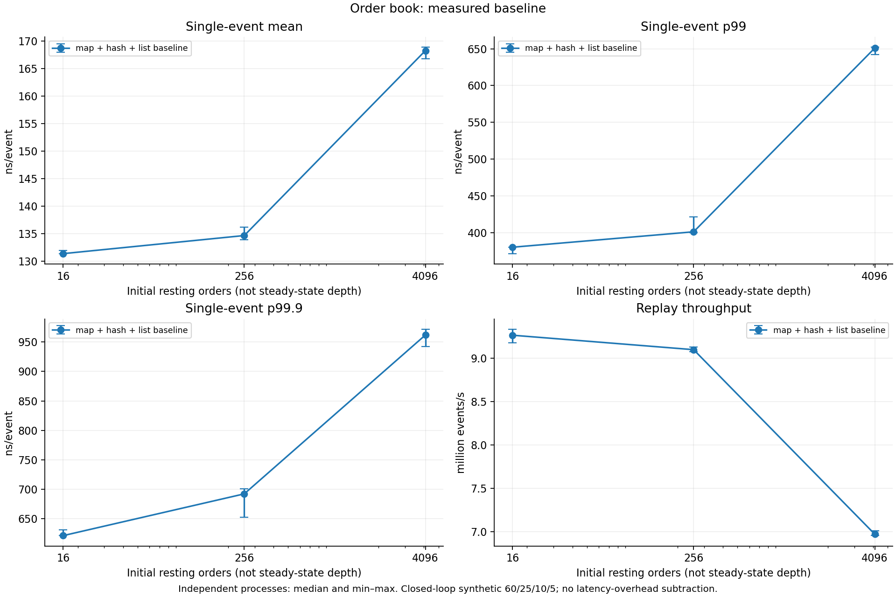
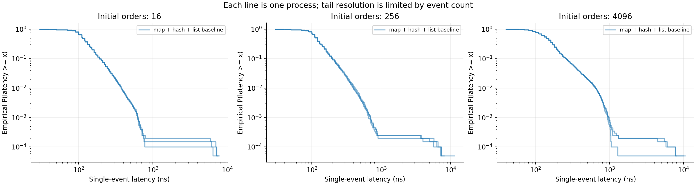
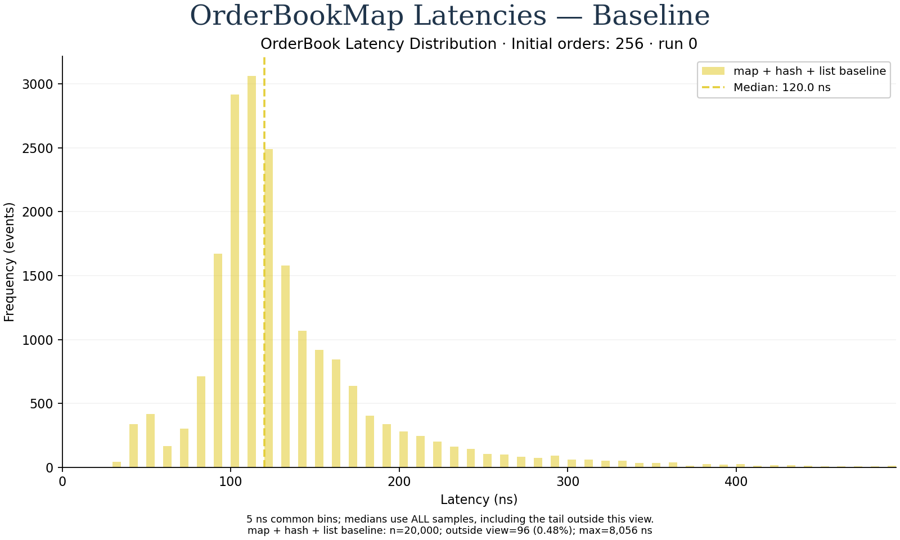

# OrderBook v0 基线：实现、实测与图表

2026-09-27。本轮仅实现 `map + unordered_map + list` 基线 `map_list`；后续优化尚未执行。本报告是实现者测试与自查，不声称独立审查。

## 可运行内容

- Add/Cancel/Modify/Match，价格优先与同价 FIFO；同价减量保序，加量/改价重新排队并允许立即撮合。
- 独立 vector/reference 逐事件对照状态码、全部成交、剩余量和完整 FIFO；容量、非法输入、输出空间不足先拒绝。
- 逐事件 latency 与整段 replay throughput 分开计时；throughput 的 PMU 只计调用线程的用户态重放区间。
- 保留 v0 原始样本、环境、源码/binary 哈希和 PNG/SVG 图表，后续每版使用新 campaign 目录，多版可叠加。

结构和契约见[实验 README](../benchmarks/order_book/README.md)，源码入口为 `include/lab/order_book.hpp` 与 `src/order_book.cpp`。参考来源及与 CppCon 行情簿的区别见[阅读笔记](order_book_cppcon_reference.md)；此处不声称复现 Optiver 生产系统。

## 正确性与构建

| 配置 | CTest | 证据 |
|---|---|---|
| GCC 13.3 Release (-O3, no native/LTO) | 11/11 PASS | [日志](evidence/order-book/release-tests.log) |
| GCC Debug ASan+UBSan | 11/11 PASS | [日志](evidence/order-book/asan-tests.log) |
| Clang 18.1.3 Release (-O3, no native/LTO) | 11/11 PASS | [日志](evidence/order-book/clang-tests.log) |

四个 seed 合计 32,000 个随机事件逐步比较完整状态；确定性测试另覆盖跨价位、双向/部分成交、FIFO、修改优先级、ID 复用、拒绝不变状态、满簿替换与输出上界。2,000 笔订单的 hash 增长/撤单/整簿成交测试验证稳定 iterator。CLI 覆盖 JSON/CSV、相同 trace、操作比例、duration 前缀及参数边界。三个构建均无编译告警；sanitizer 数据不用于性能结果。

分配异常保护采用先准备节点、再执行无分配撮合的代码路径；本轮没有做全局 allocator 故障注入测试。复制/移动 Book 被禁用，单线程拥有所有节点，不引入 MPSC。

## 测量条件

AMD EPYC 7C13，单线程固定 CPU 0；GCC 13.3 Release -O3 -DNDEBUG，native/LTO 关闭。seed=42，初始挂单数 16/256/4096，各自 20,000 个 synthetic 60/25/10/5 事件。每组做三次独立进程；latency 预热 1,000 事件后恢复初始状态，throughput 预热 3 段后测 30 次完整重放。构建和测试结束后串行测量，未修改 governor、SMT、隔离核或全局 perf 设置。

没有扣除 timer 开销。latency 样本为一次 apply；throughput 样本为 20,000 事件均值，包含事件循环和结果 journal 写入。setup/生成/reference/reset/验证不在计时内。closed-loop，不表示开放到达或网络排队延迟。

## 主要结果

每格为三个进程对应统计量的中位数；吞吐来自单独批量计时，不能用单事件 latency 的倒数替代。

| 初始挂单 | mean ns/event | p50 | p99 | p99.9 | 批量吞吐 million events/s |
|---:|---:|---:|---:|---:|---:|
| 16 | 131.35 | 111.00 | 380.00 | 621.00 | 9.262 |
| 256 | 134.64 | 120.00 | 401.00 | 692.00 | 9.096 |
| 4096 | 168.23 | 141.00 | 651.00 | 962.00 | 6.970 |

图中误差线为三次运行 min–max，点为中位数，不是置信区间。单事件 p999 每轮约依赖最慢 20 条，不能据此宣称稳定的生产尾延迟。

尾部分布每条线对应一个进程；重复的纳秒值合并后计算经验 P(latency≥x)，不合并三轮来伪造更多独立 tail 样本。提供 [summary SVG](evidence/order-book/plots/order-book-summary.svg) 和 [tail SVG](evidence/order-book/plots/order-book-tail.svg)。

## 实际事件流与深度变化

| 初始挂单 | 最低 | 峰值 | 最终 | 成功事件/20000 | not_found | 成交笔数 |
|---:|---:|---:|---:|---:|---:|---:|
| 16 | 0 | 34 | 11 | 19895 | 105 | 7426 |
| 256 | 0 | 258 | 8 | 19890 | 110 | 7667 |
| 4096 | 320 | 4096 | 320 | 20000 | 0 | 11706 |

三组均无 invalid/duplicate/full/output_full 拒绝。小簿会被消耗至空，Cancel/Modify 在无活跃 ID 时产生 not_found；这些事件照常计入混合负载。初始 4096 的簿也逐步下降到 320。因而这组图比较的是明确的重放轨迹，**不是固定深度的查找/撮合扩展性**。如后续需要稳定深度，应新增 workload 版本并同时重测 v0，不能直接与当前曲线拼接。

## 热路径 PMU

每次完整 replay 在恢复后开启、校验前关闭 cycles/instructions group。当前九个 throughput 进程的 running/enabled 均为 1；以下为三轮中位数。

| 初始挂单 | cycles/event | instructions/event | IPC |
|---:|---:|---:|---:|
| 16 | 331.97 | 780.41 | 2.351 |
| 256 | 337.98 | 787.40 | 2.330 |
| 4096 | 441.44 | 812.65 | 1.841 |

这些计数包含 timer/control 和 replay journal，不含内核/虚拟机。IPC 下降并不能单独证明 cache miss 是瓶颈；本轮没有 cache/branch 热点归因实验。完全 crossing 的 Add 仍分配节点，hash 没有额外 reserve，这些都保留为可独立验证的后续因素。

## 保存与复现

原始运行目录 `results/raw/order-book-v0-20260927/`；18 个独立进程，180,000 个逐事件样本及 270 个完整 replay 样本。原始目录默认被 Git 忽略，另保存以下可随仓库携带的证据：

- [全部结果和原始样本 JSON.gz](evidence/order-book/baseline-results.json.gz)
- [命令、源码/binary/绘图哈希](evidence/order-book/provenance.json)
- [环境](evidence/order-book/environment.txt) 与 [campaign 日志](evidence/order-book/campaign-run.log)
- [绘图输入及三轮统计 JSON](evidence/order-book/plots/summary.json)
- [兼容输入叠图/不兼容 trace 拒绝测试](evidence/order-book/plot-validation.log)

绘图脚本在测量后修正了离散相同 latency 值的 CCDF 处理，并补充线程数兼容检查；未改 benchmark、事件流或二进制。provenance 保留测量时及最终绘图脚本哈希。

完整每组统计：

- [n16-latency](evidence/order-book/n16-latency-summary.md)
- [n16-throughput](evidence/order-book/n16-throughput-summary.md)
- [n256-latency](evidence/order-book/n256-latency-summary.md)
- [n256-throughput](evidence/order-book/n256-throughput-summary.md)
- [n4096-latency](evidence/order-book/n4096-latency-summary.md)
- [n4096-throughput](evidence/order-book/n4096-throughput-summary.md)

复现与后续多版比较命令见[README](../benchmarks/order_book/README.md)。按[优化关卡](order_book_plan.md)，三次独立测量不计作三轮优化；后续按照 CppCon 讲义先做随机化分配测量对照，再逐步改变价位结构、方向和搜索方法，保留相同语义和输入，展示收益或退化。

## 基线 commit 与讲义风格直方图

基线已保存为 commit `e82ed12`。此次仅改绘图和后续计划，重用原始 campaign；没有重跑性能测量或改动 C++ 撮合代码，也没有新增优化结果。

示例选定第 0 轮、初始挂单 256、20,000 个事件、5 ns 分箱；完整样本 median 为 **120 ns**。默认视窗按 p99.5 向上取整到 495 ns；超出窗口的 96 个事件（0.48%）仍参与统计，max 为 8,056 ns。该图是单轮分布，前表仍是三轮统计量的中位数。两者不混用。

现有数据仅支持黄色基线分布。绘图工具已支持以后真实测得的版本以相同 bin 边界叠加蓝色分布和 median 虚线；没有使用讲义中的 33/63 ns 充当本机结果。对应 [SVG](evidence/order-book/histograms-v0/order-book-histogram-n256.svg)、[分箱与轮次数据](evidence/order-book/histograms-v0/histograms.json)及[验证日志](evidence/order-book/histograms-v0/validation.log)另行保存；旧 summary/CCDF 和原始证据保持原样。

绘图更新后的 Release CTest 为 **12/12 PASS**，包含新增的 5 个 histogram contract 用例；另用真实基线数据的临时副本验证双 campaign 叠图、all 轮次及裁剪后计数守恒。副本只是绘图自测，不作为新测量留档。
